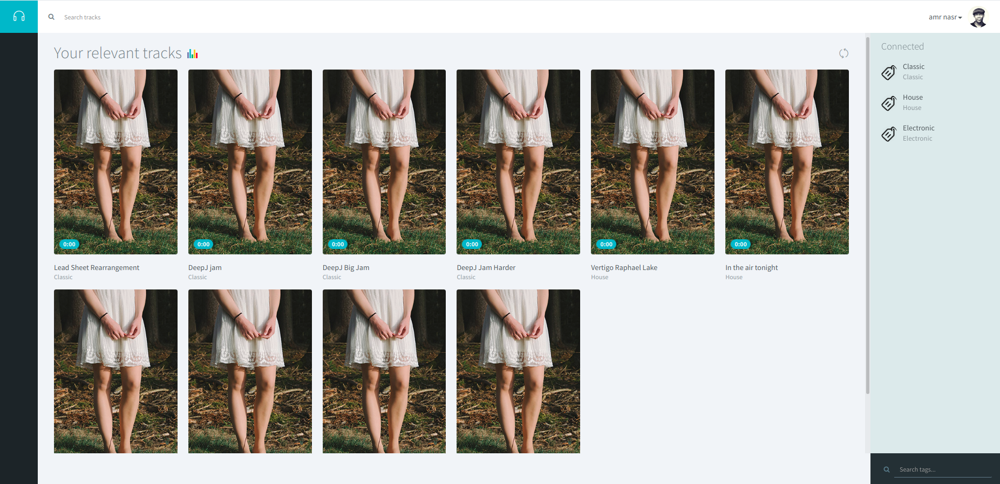
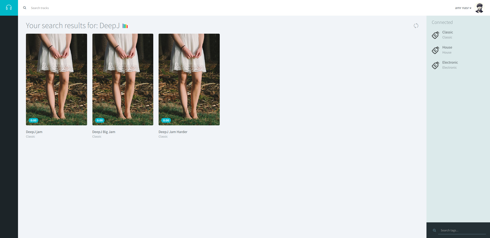
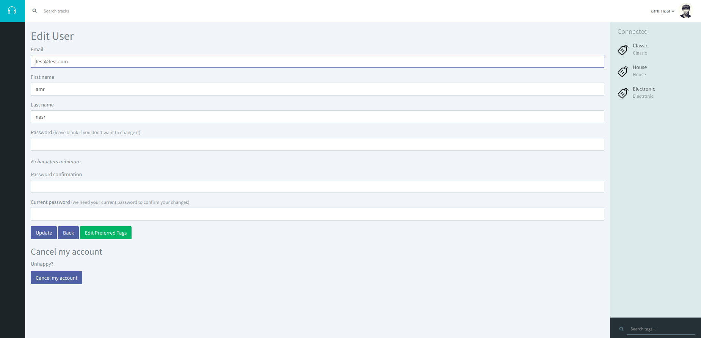
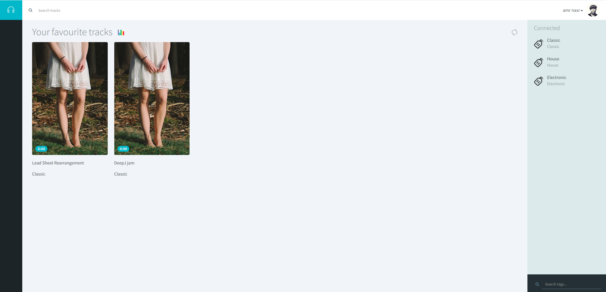
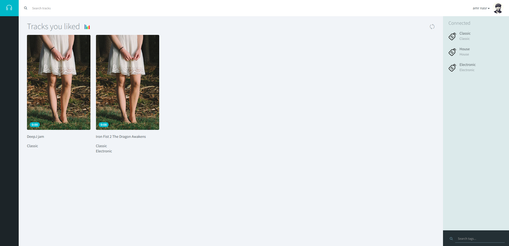
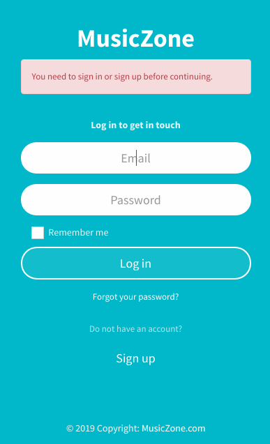
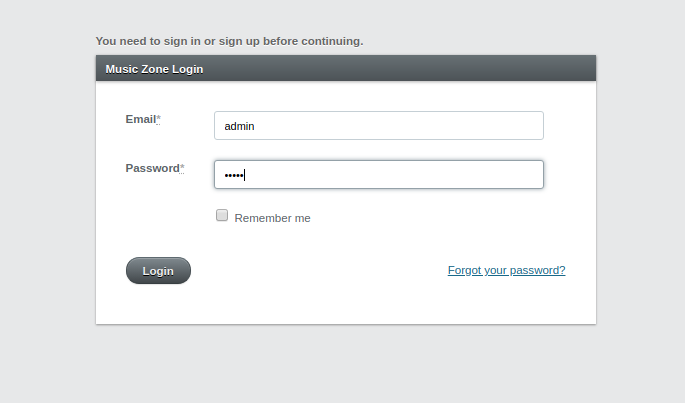
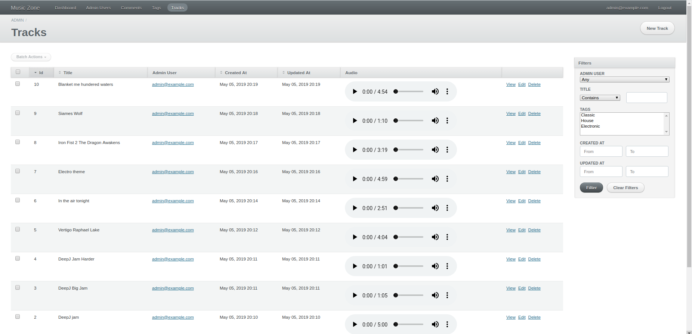

# Music Zone: An Online Virtual Music Listening Platform
---
## Overview
A website project done in Software Engineering Course in a series of sprints. This project is done in ruby on rails and developed using test-driven development.
---
## Features
* Supports user and admin roles.
* User login and registration.
* Admins can add music tracks(mp3 format), edit music tracks information, delete tracks from system, play the tracks and tag tracks.
* Users can choose favourite tags to be shown to him on homepage, can edit information, search by title or tag, play music, like or add track to favorites.
* Users can view liked or favourite tracks.
---
## Sample Runs
Features are shown in the following sample runs:
 

